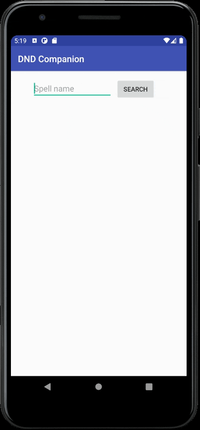

# dnd-companion
### Small personal android application used to quickly get information about spells in Dungeons and Dragons.

Uses [D&D 5th Edition API](http://www.dnd5eapi.co/) to get information about the spells and then parses the response for the relevant information. 

